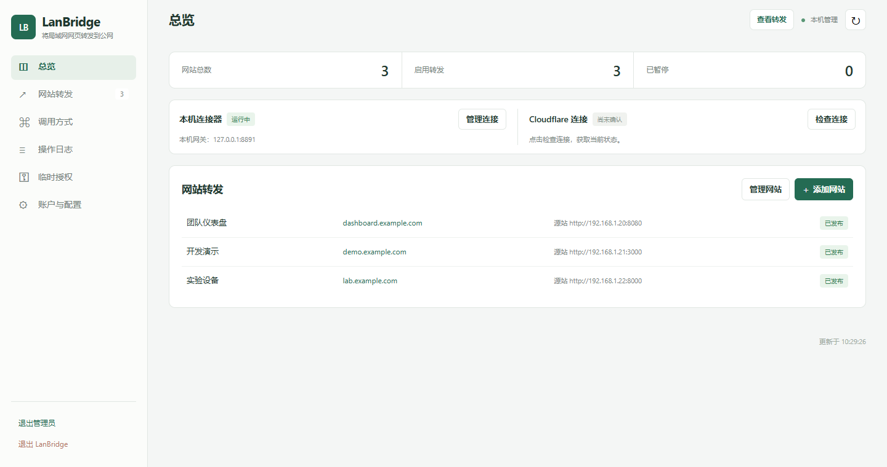
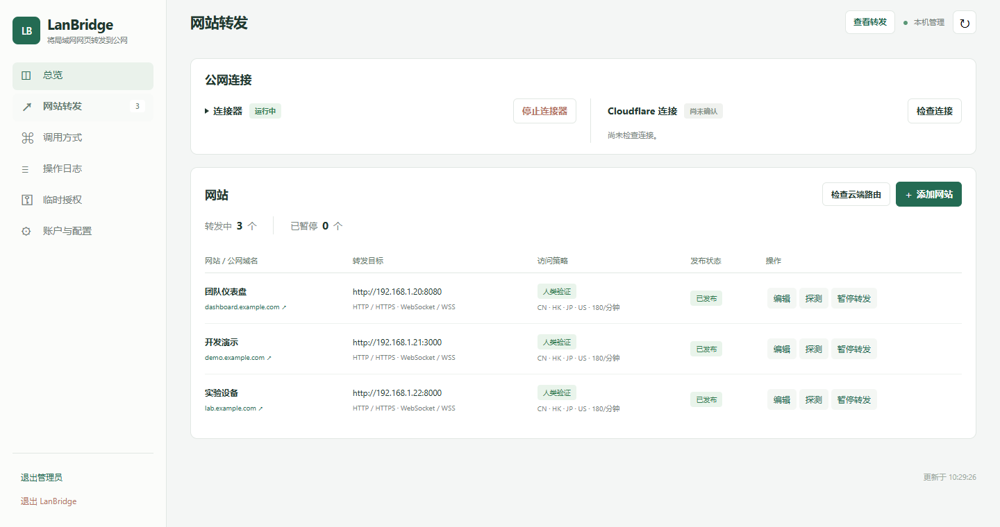

# LanBridge

**局域网网站转发到公网**

LanBridge 是面向 Windows 的自托管 Cloudflare Tunnel 管理工具。把 NAS 面板、开发服务、实验设备网页或内部工具映射到自己的公网根域名或子域名，集中管理网站、连接器和访问权限。无需在路由器上配置公网端口转发，也无需修改源站网页来加入人类验证。

**当前代码版本：1.1.0-dev（开发版）** · [开发版说明](docs/development.md) · [使用指南](docs/user-guide.md) · [反馈问题](https://github.com/mzer0-yu/LanBridge/issues)

`dev` 分支为最新开发版，包含最新功能与修复，尚未作为正式 Release 发布。已有正式版本仍为 [v1.0.0](https://github.com/mzer0-yu/LanBridge/releases/tag/v1.0.0)，其下载包不包含当前全部开发改动。

> 采用 [MIT 许可证](LICENSE)，欢迎使用、修改、分享和参与开发。本项目不是 Cloudflare 官方产品。



## 能做什么

| 功能 | 用途 |
| --- | --- |
| 多网站转发 | 将公网根域名或不同子域名映射到对应局域网源站，支持 HTTP / HTTPS 和 WebSocket / WSS |
| 静态网页托管 | 将独立目录的 HTML 主页文件 URL 作为转发目标，直接提供个人介绍、联系方式及静态资源 |
| Cloudflare 配置管理 | 接入账户，准备 Tunnel、DNS 与 Turnstile，预览变更、发布并核验 |
| 网页访问保护 | 人类验证、可选访问口令、国家/IP 访问策略与请求限速 |
| 网站暂停与恢复 | 暂停某个网站的转发并保留配置，不必删除网站 |
| 连接器管理 | 检测、准备和更新 cloudflared，控制启动、停止及启动时自动连接 |
| Windows 启动器 | 选择管理端口、检测端口冲突、查看本机实例、打开管理台、关闭或重启实例 |
| 临时协作授权 | 签发有期限、按权限范围授权的管理令牌，支持使用记录与撤销 |
| 操作记录 | 按容量保留管理操作记录，默认上限 10 MB，支持 JSONL 导出和日志 URL |
| 自动化入口 | CLI、HTTP API、MCP 与 Agent 操作说明共用业务核心 |

## 适合哪些场景

- **家庭与个人工具**：在外访问自己维护的 NAS 网页、家庭仪表盘或个人 Web 服务。
- **开发与协作**：向朋友展示开发服务，或让协作者远程访问测试界面。
- **设备与实验室**：查看局域网设备网页、实验工具或监控面板。
- **Agent 管理**：通过受限临时令牌，让 Agent 在授权范围内管理网站及发布流程。

LanBridge 转发的是网页和所选协议流量，不提供通用 VPN 或任意 TCP 端口隧道。源站自身的账户、登录和业务权限仍由源站应用负责。

## 它如何工作

```text
外网访客
   ↓ HTTPS
Cloudflare → Cloudflare Tunnel → LanBridge 本机网关
                                      ↓ 验证与访问策略
                                 局域网网页 / 服务

本机管理员 → LanBridge 管理台 → Cloudflare API 与本机配置
```

运行 LanBridge 的电脑需要能够访问局域网源站，并通过 cloudflared 与 Cloudflare 建立连接。电脑、连接器和源站都正常运行时，外网访客才能访问网站。

默认管理台与转发网关仅监听本机回环地址。正常使用无需把这两个端口直接暴露到外网；只有显式添加 LanBridge 公网入口后，才启用相应的远程访问模式。

## 安装前准备

| 项目 | 要求 |
| --- | --- |
| 运行电脑 | Windows，能够访问要转发的局域网网站 |
| Python | Python 3.12+；首版是源码发行包，需要安装依赖 |
| Cloudflare | Cloudflare 账户，以及已接入 Cloudflare 的域名 |
| 网络 | 能联网安装依赖、调用 Cloudflare API 并运行 Cloudflare Tunnel |
| 局域网源站 | 已运行的网页服务，例如 `http://192.168.1.20:8080` |

不要求公网 IP 或路由器入站端口映射。首版不是独立的免安装 EXE，也不会默认安装 Windows 服务或设置开机自启。主要运行和验证目标为 Windows。

## 快速开始

### 1. 下载并安装依赖

从 [v1.0.0 Release](https://github.com/mzer0-yu/LanBridge/releases/tag/v1.0.0) 下载 `LanBridge-v1.0.0-source.zip`，解压到准备长期使用的目录。也可以克隆仓库：

```powershell
git clone https://github.com/mzer0-yu/LanBridge.git
Set-Location -LiteralPath .\LanBridge
```

在项目目录打开 PowerShell，运行：

```powershell
powershell -NoProfile -ExecutionPolicy Bypass -File .\install.ps1
```

安装脚本在项目内建立 `.venv`，按锁定依赖清单安装。若 `python` 不在 PATH，可指定完整路径：

```powershell
powershell -NoProfile -ExecutionPolicy Bypass -File .\install.ps1 -PythonPath "C:\Path\To\python.exe"
```

Release 附带 `SHA256SUMS.txt` 和 `manifest.json`。可用以下命令计算下载 ZIP 的 SHA-256，与校验文件对比：

```powershell
Get-FileHash -Algorithm SHA256 .\LanBridge-v1.0.0-source.zip
```

### 2. 启动并创建管理员

双击 **`start.cmd`**：

1. 确认管理台端口，默认 `8890`；如被其他程序占用，可以直接在启动器修改。
2. 按需勾选“启动后打开管理台”。取消勾选时只启动后台服务。
3. 点击“启动 LanBridge”，等待启动结果。
4. 首次进入管理台时，设置管理员用户名和至少 12 位密码。

默认管理地址为 `http://127.0.0.1:8890/admin`；修改端口后，以启动器显示的地址为准。端口成功绑定后保存，下次启动会读取保存值或待生效设置。服务后台运行，启动器不需要持续打开。

### 3. 接入 Cloudflare

在“账户与配置”接入 Cloudflare，可使用浏览器授权，或提供所需权限的 API Token。浏览器授权后自动复用本机隧道配置或创建专用隧道，并加密保存连接令牌；配置失败可继续配置，无需重复授权。手动 API Token 接入按页面引导完成配置检查。

cloudflared 的自定义路径可留空，通过界面检测或从 Cloudflare 官方发布准备连接器，也可指定已有的 `cloudflared.exe`。连接器二进制保存在本机，不包含在源码包内。

详细授权方式与配置说明见 [使用指南](docs/user-guide.md)。

### 4. 添加并发布网站

例如，局域网服务为 `http://192.168.1.20:8080`，希望用自己的 `demo.example.com` 访问：

1. 先确认运行 LanBridge 的电脑能打开源站网页。
2. 到“网站转发”添加网站，填写公网域名和局域网源站地址。源站 URL 使用协议、主机和端口，不带路径。
3. 按需要设置人类验证、访问口令、允许国家、IP 范围和限速。
4. 保存后查看云端发布结果；路由变更会自动检查、发布并核验，失败时可查看原因并重试。
5. 确认连接器已运行，并进行连接核查。
6. 使用外部网络访问公网域名，验证网页、源站登录和需要的 WebSocket 功能。

启用人类验证的网站可由平台自动配置专属 Turnstile Widget。自动发布失败时，本机网站配置仍可保留；“已保存”和“公网可访问”是不同结果，应分别检查。Cloudflare API 连接核查也不能替代实际外网访问。



*截图全部使用虚构域名和测试配置，不是可访问的在线演示。*

## 两个端口分别做什么

| 端口 | 默认值 | 用途 | 修改方式 |
| --- | --- | --- | --- |
| 管理台端口 | `8890` | 管理页面、只读转发列表及管理接口 | 启动前在启动器修改；运行中在“本机与安全”保存，下次启动或重启生效 |
| 转发网关端口 | `8891` | 接收本机 cloudflared 转来的流量，并执行验证和网站转发 | 在“本机与安全”修改；正常运行时下次启动生效，网关启动失败时可修改后恢复 |

两个端口必须不同，范围为 `1024–65535`。

- **管理台端口冲突**：启动器提示被占用或被系统保留，选择其他端口后重试，不会停止占用端口的其他程序。
- **网关端口冲突**：管理台仍可启动。进入“本机与安全”调整网关端口，或释放占用后重试启动网关。
- **运行中修改管理台端口**：保存后当前地址继续可用；点击“重启 LanBridge”或下次启动后应用。填回当前端口并保存可取消待生效修改。
- **重启前发现新管理端口被占用**：拒绝重启并保留当前服务；启动阶段发生竞争占用时尝试恢复旧管理端口，并保留待生效设置。
- **修改网关端口后**：若已有 Tunnel，需要在“网站转发”重试发布，使云端路由与新网关端口一致。

## 日常启动、停止与实例管理

同一 Windows 用户会话、同一项目目录只保留一个启动器窗口。重复运行 `start.cmd` 会请求唤回已有窗口；不同安装目录可分别打开启动器。

启动器会列出可识别的本机 LanBridge 实例，显示管理端口和运行目录。选中实例后可以打开管理台、正常关闭或重启；关闭、重启前会显示确认。检测不到时先重新检测，不要仅凭一个被占用的端口判断它就是 LanBridge。同一数据目录只允许一个服务实例。

| 操作 | 对后台服务的影响 |
| --- | --- |
| 关闭浏览器或启动器窗口 | 服务继续运行 |
| 退出管理员 | 仅注销管理会话，服务和转发继续运行 |
| 停止连接器 | 管理台继续运行，公网 Tunnel 连接停止 |
| 暂停某个网站 | 暂停该网站转发，保留配置 |
| 退出 LanBridge / 关闭实例 | 停止对应实例的管理台、网关及平台启动的连接器，保留配置和云端资源 |
| 重启 LanBridge / 重启实例 | 短暂中断服务，应用待生效设置，并恢复此前的连接器运行或停止状态 |

“启动时自动连接”位于“账户与配置 → Cloudflared 连接器”，默认开启，只能由本机管理员修改。普通启动在隧道、连接令牌和连接器就绪时尝试一次自动连接；未配置或失败时管理台仍可使用，完成配置后可手动启动。

保存自动连接选项不会立即启停连接器。手动停止后，本次运行保持停止；下次普通启动按该选项执行。重启保留此前连接器状态，打开已有实例也不会改变连接器状态。

## 管理台、转发列表与访问保护

- **`/admin` 管理台**：登录后管理网站、发布配置和查看状态。
- **`/client` 转发列表**：无需管理登录的只读网站列表，显示公网入口、局域网源站及发布状态。
- **公网转发列表开关**：在“账户与配置 → 公网访问”修改“启用转发列表页面 /client”；关闭后本机列表、管理台和其他网站转发不受影响。
- **本机专属操作**：管理员密码、端口设置、自动连接设置及管理台重启等操作保留本机权限边界，公网管理不能执行这些操作。
- **临时令牌**：给朋友或 Agent 分配实际需要的权限和有效期，无需共享管理员密码；可随时撤销。

Turnstile 人类验证与可选访问口令用于 LanBridge 的入口保护，不能替代源站自己的账户权限。操作记录用于管理操作追踪，不等于逐条记录所有转发网站的访客访问。

## Agent 与命令行

Agent 可直接调用 `run.py`，无需操作图形启动器。以下命令在项目目录执行：

```powershell
# 查看可用能力与命令
.\.venv\Scripts\python.exe run.py capabilities
.\.venv\Scripts\python.exe run.py --help

# 检测本机已运行实例
.\.venv\Scripts\python.exe run.py instances

# 前台运行；不主动打开浏览器
.\.venv\Scripts\python.exe run.py serve
```

`serve` 是持续运行的前台命令。需要后台运行、选择端口、确认服务就绪或控制实例时，请按 [Agent 启动与实例控制说明](docs/agent-startup.md) 使用对应参数和结果文件。`start.cmd` 是图形入口，不解析 CLI 参数。

启动器左下角“Agent / CLI 说明”可直接打开文档；右键或 Shift+F10 可复制文件路径或文件 URL。文件 URL 仅供能访问该路径的本机使用，不是公网分享地址。

HTTP API、MCP 和临时令牌用法见 [使用指南](docs/user-guide.md)，Agent 操作流程见 [项目 Skill](skills/lanbridge/SKILL.md)。

## 常见问题与排错

| 现象或问题 | 处理方式 |
| --- | --- |
| 提示尚未安装依赖 | 确认 Python 3.12+，在项目目录运行 `install.ps1`；必要时指定 `-PythonPath` |
| 管理台端口被占用 | 在启动器选择其他端口，以显示的新地址访问 |
| 能打开管理台，但公网无法访问 | 分别检查源站、本机网关、连接器和云端发布状态，再从外网验证 |
| 启动后连接器没有运行 | 检查自动连接开关、隧道配置及 cloudflared 是否就绪，查看原因后手动启动 |
| 网站配置已保存，云端发布失败 | 查看具体错误，修正权限、域名或连接条件后在网站转发中重试 |
| 修改网关端口后公网访问异常 | 让新端口生效，并重新发布云端路由 |
| 已运行实例不能使用启动器启停 | 旧版本可能没有控制能力；从旧管理台正常退出，再通过新版启动器启动 |
| 想只启动服务，不开浏览器 | 取消启动器的“启动后打开管理台” |
| 想查看启动终端诊断 | 在 PowerShell 运行 `start.ps1 -NoDialog`，或使用前台 `run.py serve` |

**能给朋友使用和修改吗？** 可以。MIT 许可证允许使用、修改、分享和商业使用，须保留版权与许可声明。第三方组件遵循各自许可证。

**支持 Linux/macOS 吗？** 首版主要运行和验证目标为 Windows。代码有部分其他平台分支，但尚未完成同等跨平台验收。

**复制源码到另一台电脑后会带走配置吗？** Release 不包含本机配置。运行配置和加密凭据位于 `data/`；Windows 凭据保护绑定当前用户，复制数据到其他账户不等于可用迁移。迁移前请阅读 [安全说明](SECURITY.md)。

反馈故障时请提供版本、操作步骤、预期结果和不含敏感信息的错误提示；不要将密码、Token、Cookie、数据库或保险库上传到公开 Issue。安全问题报告方式见 [SECURITY.md](SECURITY.md)。

## 文档与开发

| 文档 | 内容 |
| --- | --- |
| [使用指南](docs/user-guide.md) | 账户接入、网站配置、访问保护、API / CLI / MCP |
| [Agent 启动与实例控制](docs/agent-startup.md) | 后台启动、就绪判断、目标识别、关闭和重启 |
| [Agent 操作 Skill](skills/lanbridge/SKILL.md) | 自动化管理工作流与授权范围 |
| [安全说明](SECURITY.md) | 凭据保护、部署边界及安全问题报告 |
| [v1.0.0 发布说明](docs/releases/v1.0.0.md) | 发行内容、安装方式和验证限制 |
| [开发规则](AGENTS.md) | 修改约定、目录职责与验证要求 |
| [当前验证状态](docs/review-status.md) | 最近检查结果与未覆盖范围 |
| [浏览器检查](tests/ui/README.md) | 隔离前端验收方法 |
| [性能测量与本地打包](docs/performance-and-release.md) | 测量方法、源码打包和校验文件 |
| [已修复问题](docs/fixed-issues.md) / [检查历史](docs/history.md) | 已确认缺陷及历史验证记录 |

```text
LanBridge/
├─ start.cmd / start.ps1   Windows 图形启动入口
├─ install.ps1            创建虚拟环境并安装锁定依赖
├─ run.py                 CLI 与服务运行入口
├─ mcp_server.py          MCP 入口
├─ lanbridge/             后端、网关、业务和存储
├─ ui/                    管理台、转发列表及图标
├─ scripts/               维护、测量与发布工具
├─ skills/                Agent 操作说明
├─ tests/                 后端、前端与隔离浏览器检查
├─ docs/                  用户文档、开发记录和示例截图
├─ data/                  本机配置、加密凭据与日志（运行生成，不提交）
├─ bin/                   本机连接器（按需准备，不提交）
└─ .venv/                 本机 Python 依赖（安装生成，不提交）
```

`requirements.txt` 记录直接依赖，`requirements.lock.txt` 固定完整依赖版本；安装脚本读取锁定清单，两者用途不同。

v1.0.0 发布前通过 318 项 Python、62 项 Node、15 组隔离浏览器检查及启动器专项检查。测试覆盖不代表所有部署都无故障，真实公网长期连接、满载压力和不同安装环境仍需按实际场景验证。详细证据以当前验证状态为准。

## English overview

LanBridge is a Windows-first, self-hosted control panel for exposing LAN web services through Cloudflare Tunnel. It combines website mappings, connector management, Turnstile verification, access policies, temporary scoped management tokens, and CLI / HTTP API / MCP interfaces.

The source release requires Python 3.12+, a Cloudflare account and a domain. Install dependencies with `install.ps1`, then open `start.cmd`. The launcher checks the management port, detects running instances and offers start, stop and restart controls. Opening the browser after startup is optional; closing the launcher leaves the service running.

The management port defaults to `8890`, and the forwarding gateway to `8891`; both listen on loopback. Port settings and connector auto-start can be managed locally. Each data directory allows one service instance, and each installation directory allows one launcher window per Windows user session.

See the [user guide](docs/user-guide.md), [Agent startup guide](docs/agent-startup.md) and [security notes](SECURITY.md). Licensed under the [MIT License](LICENSE). LanBridge is not an official Cloudflare product.

更新机制与 CLI 关闭方式见 [自动重载说明](docs/hot-reload.md)。默认检测普通源码更新并受控重载，允许短暂中断；首次加载此机制需要重启一次。
